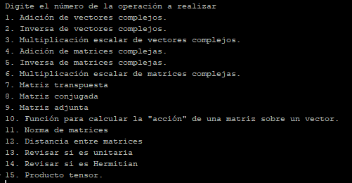
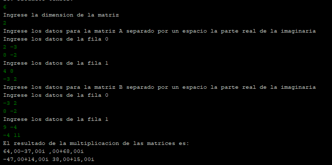

# Calculadora-Vectores-Matrices-CNYT


## Empezando

>Para clonar el archivo 

git clone https://github.com/nontoa/Calculadora-Vectores-Matrices-CNYT.git
>
### Prerrequisitos
* Maven
* Java
* Git


## Construido con

* [Maven](https://maven.apache.org/) - Gestión de dependencias

## Números complejos:

Un número complejo, es una entidad matemática que viene dada por un par de números reales, el primero x se denomina la parte real y al segundo y la parte imaginaria. Los números complejos se representa por un par de números entre paréntesis (x, y), como los puntos del plano, o bien, en la forma usual de x+yi, i se denomina la unidad imaginaria, la raíz cuadrada de menos uno.

## Funcionamiento del programa:

### Menu:

Hay un menú para elegir la operacion a realizar con n números complejos.



### Ingresando datos y resultado:

Escogemos una opción del menú y digitamos el número correspondiente y presionamos enter.

Enseguida depende de la operación escogida nos pedira difrentes datos.

En este caso digitaremos la dimension de la matriz y luego digitaremos los números separados por un espacio la parte real y la parte imaginaria.

Por último veremos el resultado en este caso de la multiplicación de las matrices.




## Descripción del programa:

## Código encargado para operaciones lógicas.

```java


```


## Autor


* **Juan Nicolas Nontoa Caballero**  Calculadora-Vectores-Matrices-CNYT - [nontoa] (https://github.com/nontoa)

## licencia

Este proyecto está licenciado bajo la Licencia GNU - vea el archivo [LICENSE](LICENSE) para más detalles.

